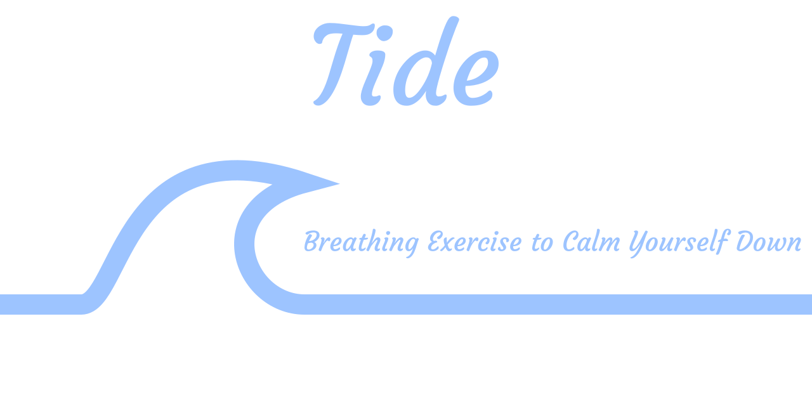

# :ocean: Tide - Breathing Exercise to Calm Yourself Down

[](https://github.com/Cynnexis/tide/actions/workflows/main.yml)



Tide is an application that helps reduce panic attacks with a simple breathing exercise.

## :dart: Goals

Panic attacks can happen anywhere, at anytime.
In a world where we have access to a limitless number of digital resources at the tip of our fingers, we can reduce those attacks through different ways (apps, videos, etc.).
However, as I experienced multiple times, most of those resources are placed behind advertisements, which can be irritating or even aggravating depending on the content.
Those useful resources should always be available for people traversing those delicate moments, and have an ads-free experience.

Hence, I initiated **Tide**, a very simple app that help the user to calm themselves down by timing the breath in and breath out, and imitating the diaphragm dilatation, while being **free with no advertisements**.
As a result, anyone can have this application and use it with no stress of being disturbed by one of this awful and distressful ad.

## :electric_plug: Getting Started

The following instructions will get you a copy of the source code, and help you execute it.

### :package: Requirements

This project requires [Flutter][flutter-install], SDK version: minimum 2.3.0.

### :hammer_and_pick: Installation

The first thing to do is to download the project, either by [downloading the ZIP file][tide-zip] and extract it somewhere in your machine, or by cloning the project with `git clone https://github.com/Cynnexis/tide.git tide`. The following steps will assume that the current directory is the project root.

1. `flutter create --no-overwrite .`
2. `flutter pub get`
3. `flutter analyze`
4. `flutter run`

The app should be running now.

### :whale: Using Docker

You can build a Docker image to serve the web application of Tide.
All Docker files are stored under the `docker/` folder, but you can use the `Makefile` commands to build it.

First, you need to configure the project by creating `tide.yaml` at the root of the project.
You can copy it from `tide.sample.yaml` to have the structure of the configuration.
Then, edit it to configure the Tide project and customize your Docker building process.

Finally, enter the following command:

```bash
make build-docker
```

This command will call `docker/build.bash`, a bash script that uses `tide.yaml` to build the Dockerfiles.
At the end of the process, you should have the Docker image `cynnexis/tide:web`, that you can use to serve the application:

With the Makefile:

```bash
make docker-server
```

... or with the docker command:

```bash
docker run -d \
	--name=tide-web \
	--hostname="tide-web" \
	--publish 80:80 \
	-v "/etc/timezone:/etc/timezone:ro" \
	-v "/etc/localtime:/etc/localtime:ro" \
	-e TZ \
	"cynnexis/tide:web"
```

And connect to http://localhost:80/

## :building_construction: Build With

* [Dart][dart]
* [Flutter][flutter]
* [Android Studio][android-studio]

## :handshake: Contributing

To contribute to this project, please read our [`CONTRIBUTING.md`][contributing] file.

We also have a [code of conduct][code-of-conduct] to help create a welcoming and friendly
environment.

## :writing_hand: Authors

Please see the [`CONTRIBUTORS.md`][contributors] file.

## :page_facing_up: License

This project is under the GNU Affero General Public License v3. Please see the [LICENSE][license] file for more detail (it's a really fascinating story written in there!).

[flutter-install]: https://flutter.dev/docs/get-started/install
[tide-zip]: https://github.com/Cynnexis/tide/archive/master.zip
[flutter]: https://flutter.dev/
[dart]: https://dart.dev/
[android-studio]: https://developer.android.com/studio
[cynnexis]: https://github.com/Cynnexis
[contributing]: CONTRIBUTING.md
[contributors]: CONTRIBUTORS.md
[code-of-conduct]: CODE_OF_CONDUCT.md
[license]: LICENSE
